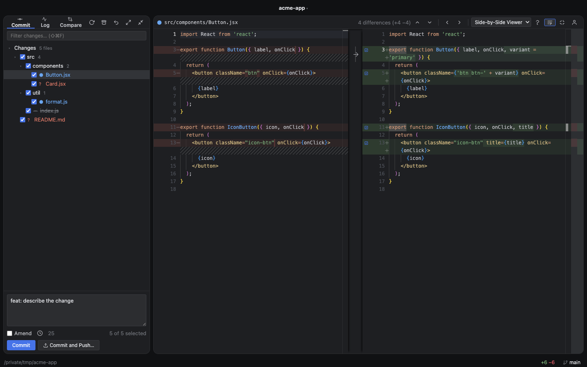
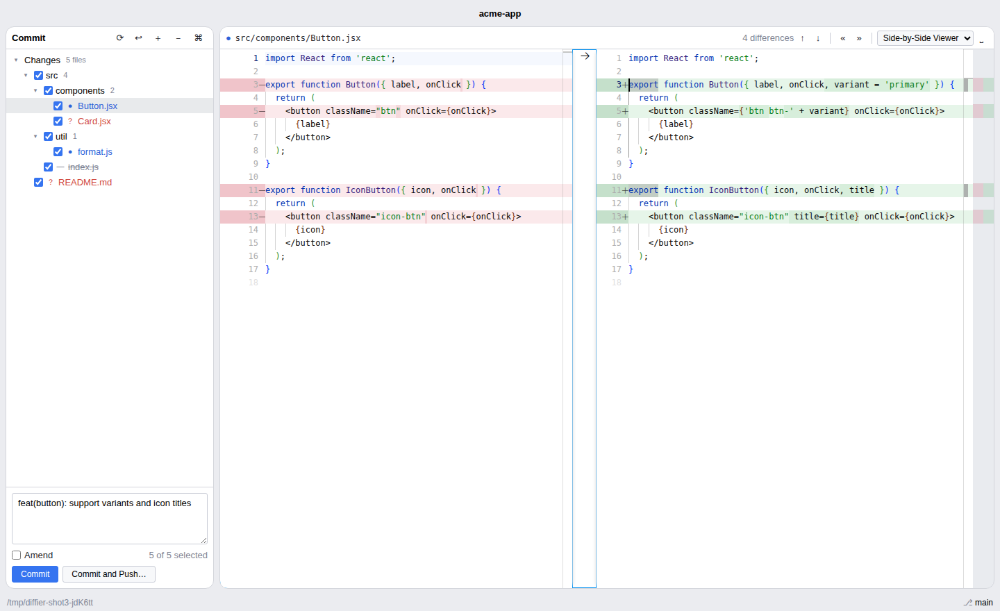

# Diffier

> **⚠️ Alpha software.** Diffier is early and evolving fast. Expect rough
> edges, missing polish, and occasional breaking changes between releases.
> It writes to your working tree and git index (commits, staging, rollback),
> so use it on repos you have backed up / can recover, and please
> [report issues](https://github.com/afitzgerald/diffier/issues) you hit.

An IntelliJ-style Git diff editor for macOS. It recreates the JetBrains
commit tool window and diff viewer — same layout, same keybindings, same
flow — as a standalone desktop app for reviewing, editing, and committing
working-tree changes in any Git repository.



<details>
<summary>Islands Light theme</summary>


</details>

## Features

- **Themes** — a port of the JetBrains **Islands Dark** UI is the default:
  the tool window and editor float as rounded panels on a darker window
  background, with the New UI color palette. **Islands Light** and classic
  **Darcula** are included; switch in Settings (`⌘,`) or **View ▸ Theme**.
  Themes restyle everything — panels, VCS status colors, buttons, and the
  Monaco editor including diff and syntax colors — and new themes are plain
  data objects in `main/themes.ts`.
- **Changes tree** — changed files grouped by directory (single-child
  directory chains compressed, IntelliJ style), with tri-state checkboxes
  to pick what goes into the commit and IntelliJ's VCS status colors
  (blue = modified, green = added, red = unversioned, grey = deleted,
  teal = moved).
- **Wide syntax-highlighting coverage** — Monaco's ~80 built-in grammars
  plus [shiki](https://shiki.style) TextMate grammars (the ones VS Code
  uses) for the languages Monaco lacks: Vue, Svelte, Astro, TOML, Makefile,
  CMake, Groovy, Haskell, Erlang, Zig, Nix, LaTeX, unified diff, Elm,
  OCaml, Crystal, Nim, Prisma, GLSL, D, Gleam, Odin, PureScript, Ada, asm,
  awk, Haxe, Common Lisp, and Racket — tokenized with shiki's pure-JS
  regex engine (no WASM) and colored by the active Diffier theme. Detection
  also handles well-known filenames (Gemfile, Jenkinsfile, CMakeLists.txt,
  .gitignore, …) case-insensitively and sniffs `#!` shebangs on
  extensionless scripts. If the shiki bundle hasn't been built, the app
  falls back to lightweight built-in grammars for the most common of these.
- **Side-by-side diff viewer** — Monaco diff editor with HEAD on the left
  and your working tree on the right.
  The right side is **editable**: type directly in the diff, changes
  autosave when you switch files (⌘S to save explicitly). Per-chunk revert
  arrows in the gutter, unified-view toggle, and an ignore-whitespace
  toggle.
- **IntelliJ navigation flow** — step through every difference in every
  file without touching the mouse: `F7` walks the differences, and at the
  last one a hint arms a second `F7` press to continue into the next
  changed file (exactly like IntelliJ's "Press F7 to go to the next file").
- **Commit tool window** — commit message box, Amend checkbox (pre-fills
  the last message), Commit / Commit and Push buttons. Commits are
  pathspec-limited to the checked files, so anything staged from the CLI
  that you didn't check stays out of the commit (merge commits record the
  whole index, as git requires). A filter box narrows the tree in big
  changesets, and the tree is windowed so repositories with thousands of
  changed files stay responsive.
- **Partial (per-hunk) staging** — every diff hunk gets a checkbox in the
  editor gutter. Unchecked hunks stay out of the commit and survive as
  local modifications: the commit is recorded through a temporary index
  (respecting `.gitattributes` filters), never touching your real index.
  Amending preserves the original author and date.
- **Commit message assistance** — subject-line length hint (50/72),
  history of previous commit messages (`⌘E`), and pre-filling from the
  repository's `commit.template`.
- **Branches, pull & fetch** — click the branch in the status bar (or
  `⌘B`) for an IntelliJ-style popup: filter, switch, check out remote
  branches, or create a new branch from the search text. Pull (`⌘T`),
  fetch, and ahead/behind arrows next to the branch name.
- **Log tab** — commit history with a lane graph, branch/tag chips,
  author and age columns, and infinite scroll. Click a commit for its
  message, metadata, and changed files; click a file for a read-only diff
  of that revision. Right-click a changed file for **Show History** — the
  log filtered to that file (following renames).
- **Compare tab** — diff any two refs (branches, tags, or raw commit
  hashes) against each other, independent of the working tree.
- **Merge conflict resolution** — conflicted files open in a resolve
  editor: ours/theirs regions highlighted and labeled with the real branch
  names, per-conflict **Accept Ours / Accept Theirs / Accept Both**
  codelens actions, whole-file accept buttons, conflict navigation, and
  **Mark Resolved** to stage the result.
- **Stash** — a dialog over `git stash`: stash with a message (optionally
  including untracked files), then pop, apply, or drop from the list.
- **Blame annotations** — toggle inline `git blame` (author, date, commit)
  at the end of every line of the diff.
- **Image diff** — changed PNGs/JPEGs/GIFs/WebP/ICOs show a side-by-side
  image preview on a checkerboard with dimensions; SVGs diff as text with
  a preview toggle.
- **Markdown preview** — markdown files get a toolbar toggle that swaps
  the text diff for rendered Old | New panes (scroll-synced); links open
  in the system browser, raw HTML in the file renders as literal text, and
  mermaid fences render as diagrams.
- **Rollback** — IntelliJ semantics: tracked files revert to HEAD, renames
  are undone, unversioned files are deleted (with confirmation).
- **Multi-repo** — the titlebar is a repo switcher with recent
  repositories; linked git worktrees are detected and badged. A repository
  path on the command line (or dropped on the dock icon) opens directly,
  and **Install Command Line Launcher…** adds a `diffier` command. The
  dock badge shows the changed-file count.
- **Live updates** — a file watcher refreshes the tree when the working
  tree or `.git` changes (commits from a terminal show up immediately).

## Keybindings (IntelliJ keymap)

Every shortcut below is the default and can be changed: open **Settings**
(`⌘,`, the ⌘ button in the Commit panel header, or the app menu), click a
shortcut, and press your preferred combination. Assigning a
combination that another action already uses steals it from that action;
`↺` resets one action, **Reset All to Defaults** resets everything, `✕`
unbinds an action. Overrides are stored in `settings.json` under `keymap`
and are applied everywhere — key handling, menu accelerators, and button
tooltips. Tree navigation (`↑` `↓` `←` `→` `Space` `⏎`) is fixed.

| Key | Action |
| --- | --- |
| `F7` / `⇧F7` | Next / previous difference; at the last one, press again to continue into the next file |
| `⌘⇧]` / `⌘⇧[` | Next / previous changed file |
| `⌥→` / `⌥←` | Next / previous changed file (when the tree has focus) |
| `↑` `↓` in tree | Select file (diff preview follows the selection) |
| `→` / `←` in tree | Expand / collapse directory |
| `Space` in tree | Toggle the commit checkbox (directories toggle the subtree) |
| `⏎` in tree | Jump into the diff editor |
| `Esc` | Back to the changes tree |
| `⌘K` | Commit (focus the message box) |
| `⌘⏎` | Commit checked files |
| `⌥⌘⏎` | Commit and Push |
| `⌘E` | Commit message history |
| `⌘⇧K` | Push |
| `⌘T` | Pull |
| `⌘B` | Branches popup |
| `⌘9` | Log tool window |
| `⌘⇧F` | Filter changes |
| `⌥⌘Z` | Rollback selected file / directory |
| `⌘S` | Save the edited file |
| `⌘0` | Toggle the commit tool window |
| `⌘O` | Open a repository |
| `⌘R` | Refresh file status |
| `⌘=` / `⌘-` | Zoom in / out (diff & markdown font size) |
| `⌘⇧0` | Reset zoom |
| `⌘,` | Settings (theme + keymap) |

Fetch, Stash, and Blame Annotations are unbound by default — bind them in
Settings or use the **Git** / **View** menus.

## Installing (Homebrew)

```sh
brew install --cask afitzgerald/diffier/diffier
```

This installs the signed, notarized `.dmg` from the latest
[release](https://github.com/afitzgerald/diffier/releases). Requires macOS
Sonoma or later. Since this is alpha software, expect frequent updates —
`brew upgrade --cask diffier` to get the latest.

The app reopens the last repository on launch; use `⌘O` to pick another.

## Running from source

```sh
yarn install   # also builds the shiki highlighter bundle (postinstall)
yarn start     # compiles the TypeScript sources first, then launches
```

## Building the macOS app

On a Mac:

```sh
yarn install
yarn dist           # compiles, rebuilds the shiki bundle, then produces
                    # dist/Diffier-<version>.dmg and .zip
```

Signing and notarizing needs a Developer ID Application certificate in the
keychain plus `NOTARIZE=1`; without it `yarn dist` still produces a working
(unsigned) app for local use. See `build/afterSign.js`.

## Releasing

Three GitHub Actions workflows, same shape end to end:

1. **Test** (`.github/workflows/test.yml`) — typecheck, unit/integration
   tests, and an unsigned build check on every PR and push to `main`.
2. **Deploy** (`.github/workflows/deploy.yml`) — runs after Test succeeds on
   `main`; computes the next `vX.Y.Z` tag from conventional-commit subjects
   since the last tag (`scripts/next_version.sh`: `type!:`/`BREAKING
   CHANGE` → major, everything else → patch), pushes it, and dispatches
   Release.
3. **Release** (`.github/workflows/release.yml`) — builds, code-signs,
   notarizes, and publishes the signed DMG/zip to a GitHub Release for that
   tag.

Release needs these repo secrets: `CSC_LINK` / `CSC_KEY_PASSWORD` (a
base64-encoded Developer ID Application `.p12` and its password, for
code-signing) and `APPLE_ID` / `APPLE_APP_PASSWORD` / `APPLE_TEAM_ID` (an
Apple ID, an app-specific password, and the team ID, for notarization).

## TypeScript

The whole app is TypeScript, compiled **in place**: `tsc` emits each
`.js` right next to its `.ts` source (no bundler, no `dist/` for source —
`dist/` is only electron-builder's packaged app output). The compiled
`.js` is committed, so cloning and running never requires a build step,
but editing a `.ts` file does — `yarn build` (or just `yarn start` /
`yarn test`, which chain the build before running). Run
`yarn typecheck` for a fast `--noEmit` check across all four
`tsconfig*.json` programs (main process, renderer, the shiki bundle
entry, tests) without writing any `.js`.

## Development & tests

- `yarn test` — recompiles, then runs integration tests for the Git layer
  (`main/git.ts`) against a throwaway repository (status parsing for
  every change type, renames, diffs, pathspec and per-hunk partial
  commits, amend author preservation, merge-commit fallback, log/commit
  details, branches, stash, blame, conflict stages and resolution,
  worktree detection, rollback, binary detection, path-escape
  protection) plus unit tests for the keymap module (normalization,
  accelerator conversion, default-conflict check), the theme registry
  (complete/consistent variable sets, valid colors, dark/light sanity),
  and language detection (grammar shape, extension-collision check,
  shiki-grammar existence, detection with and without the shiki bundle).
- `yarn build && node test/ui.test.js` — end-to-end UI test. The
  renderer talks to the main process only through `window.api`, so the
  test serves the renderer over HTTP with an RPC shim backed by the real
  Git layer and drives the full flow (tree, F7 navigation, editing +
  autosave, commit, rollback, hunk staging, blame, file history, log
  details, filtering, stash, branch create/switch, conflict resolution)
  with Playwright. Set `DIFFIER_CHROMIUM` to your Chromium binary if it
  is not at `/opt/pw-browsers/chromium`.
- `yarn smoke` — recompiles, then boots the real Electron app, loads
  the repo from `DIFFIER_SMOKE_REPO`, and fails on any renderer error.

## Architecture

Every file below is `.ts`, compiled in place to a same-named `.js`
that ships/runs unchanged (see [TypeScript](#typescript) above).

```
main/
  main.ts        Electron main process: window, menu (built from the keymap),
                 IPC, settings persistence, recursive file watcher
  git.ts         All Git operations (spawns the git CLI; no native deps)
  git-types.ts   Git domain types (FileEntry, StatusResult, ...) — no
                 runtime deps, so the renderer program can import them too
  keymap.ts      Action/keybinding logic shared by both processes
  keymap-types.ts  ActionId/KeymapAction types + the ACTIONS table
  api-types.ts   The DiffierApi surface (window.api) + Settings/RepoInfo
  themes.ts      Theme definitions (CSS variables + Monaco colors)
  preload.ts     contextBridge API — the renderer has no Node access
renderer/
  index.html   Layout: commit panel, log view, diff toolbar, popups/dialogs
  global.d.ts  Ambient globals for the renderer program: window.api's type,
               the domain types re-declared as bare globals for the
               classic-script files below
  styles.css   Themeable styles (CSS variables) + islands/classic layouts
  app/         Renderer modules — classic scripts sharing the global scope,
               loaded in dependency order (see index.html):
    core.ts            Shared state, DOM helpers, toast/status utilities
    theme.ts           Theme application and shiki theme mapping
    keymap.ts          Keybinding state, normalization, event matching
    editor.ts          Monaco bootstrap, diff editor, language detection
    zoom.ts            Session-only font-size zoom for editors/markdown
    staging.ts         Partial (per-hunk) staging and commit selection
    tree.ts            Changes tree: model, windowed rendering, filter
    markdown.ts        Hand-written GFM renderer for the markdown preview
    diff-view.ts       Diff pane: worktree/commit diffs, image preview
    conflict.ts        Merge conflict resolution editor
    blame.ts           Inline git blame annotations
    navigation.ts      IntelliJ F7-style difference navigation
    repo.ts            Repository lifecycle: status refresh, setRepo
    git-actions.ts     Commit, push, pull, fetch, rollback
    popups.ts          Popup infra, branch popup, msg history, repo switcher
    stash.ts           Stash dialog
    log.ts             Log tab: lane graph, commit details, file history
    compare.ts         Compare tab: diff two arbitrary refs
    actions.ts         Action registry and global keyboard handling
    settings-dialog.ts Settings dialog: theme picker and keymap editor
    about-dialog.ts    About dialog: app identity, version, license
    boot.ts            Menu IPC, toolbar wiring, splitter, startup
  languages.ts Language metadata: detection, aliases, Monarch fallbacks
  highlighter-entry.ts
               Shiki bundle source (esbuild → renderer/highlighter.js on
               postinstall): TextMate grammars + JS regex engine + monaco
               wiring via @shikijs/monaco
```
